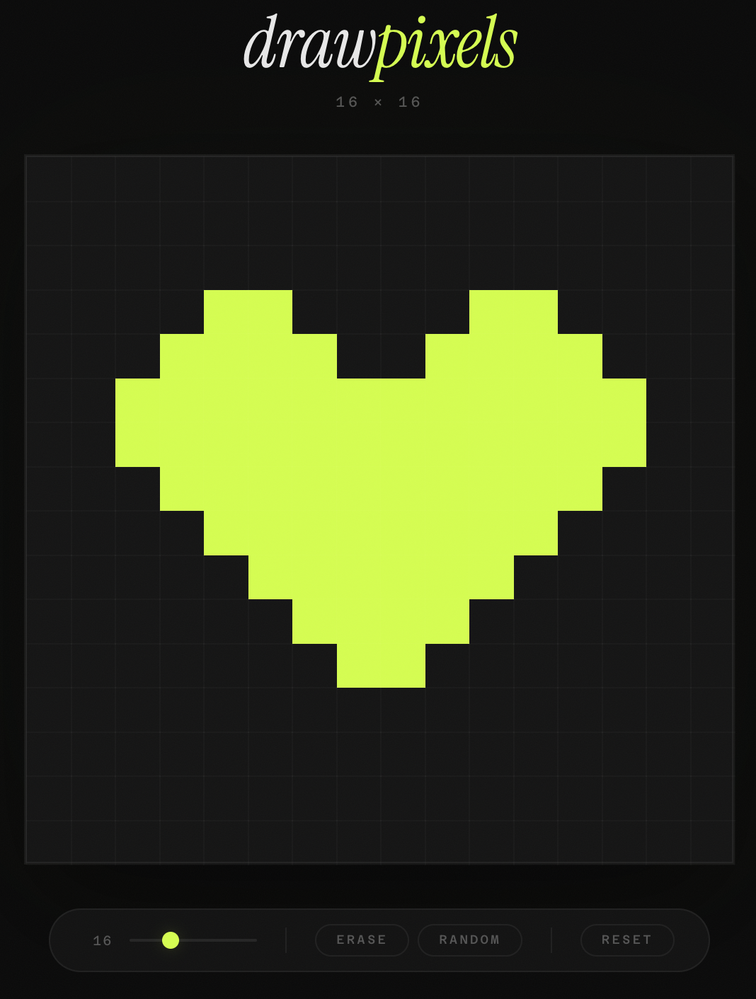

# Draw pixels

Simple application to draw pixels with mouse over.

[Live demo](https://draw-pixels.vercel.app/) 🚀



## Features

- Paint cells by hovering with the mouse
- Random color mode
- Erase mode
- Reset canvas
- Adjustable grid resolution

## Tech stack

| Role      | Tool                                                             |
| --------- | ---------------------------------------------------------------- |
| Build     | [Vite 8](https://vitejs.dev/) + [Rolldown](https://rolldown.rs/) |
| UI        | [React 19](https://react.dev/)                                   |
| Language  | [TypeScript 5](https://www.typescriptlang.org/)                  |
| Linter    | [oxlint](https://oxc.rs/docs/guide/usage/linter.html)            |
| Formatter | [oxfmt](https://oxc.rs/docs/guide/usage/formatter.html)          |
| Tests     | [Vitest](https://vitest.dev/)                                    |
| Git hooks | [pre-commit](https://pre-commit.com/)                            |

## Setup

```sh
npm install
pre-commit install
```

## Scripts

| Command          | Description                         |
| ---------------- | ----------------------------------- |
| `npm run dev`    | Start dev server with HMR           |
| `npm run build`  | Type-check and build for production |
| `npm run serve`  | Preview production build locally    |
| `npm test`       | Run tests with Vitest               |
| `npm run lint`   | Lint with oxlint                    |
| `npm run format` | Format with oxfmt                   |

## License

[MIT](LICENSE)
