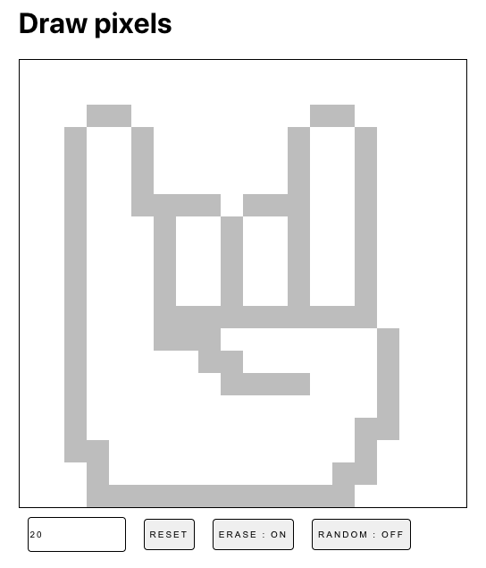

# Draw pixel

Simple application to draw pixel with mouse over

[Live demo](https://draw-pixels.vercel.app/) 🚀

# Features

- random color
- erase mode
- reset draw
- change resolution

# Run application

- `npm install` for install dependencies
- `npm run dev` for run app
